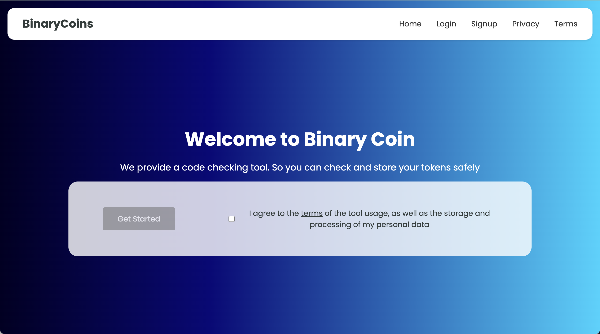

# BinaryCoin

A small web application as a part of assessment to show code skills in action.

### preview:



### Running & Demonstration :

#### Using Docker :

Ensure the latest version of Docker is installed and up and running :

##### 1.Clone the project

&nbsp;

```sh
git clone git@github.com:mohamedhemidi/sp-gdpr-binary-checker.git
cd sp-gdpr-binary-checker
```

##### 2.Build and Run the container & images

&nbsp;

```sh
docker compose build
docker compose up
```

##### 4. Run the projects

&nbsp;  
In browser navigate to **http://localhost:4200**
&nbsp;
&nbsp;

#### Local environement :

Ensure .NET 8 is install along with node.js version 20 then :

##### 1.Clone the project

&nbsp;

```sh
git clone git@github.com:mohamedhemidi/sp-gdpr-binary-checker.git
cd sp-gdpr-binary-checker
```

##### 2.Run the backend

&nbsp;

```sh
cd backend
dotnet restore "src/App/App.csproj"
dotnet build "src/App/App.csproj"

## Finally launch the project:
dotnet run watch --project ./src/App

```

##### 3.Run the frontend

&nbsp;

```sh
cd frontend
npm run install

## Finally launch the project:
npm run start
```

##### 4. Run the projects

&nbsp;  
In browser navigate to **http://localhost:4200**
